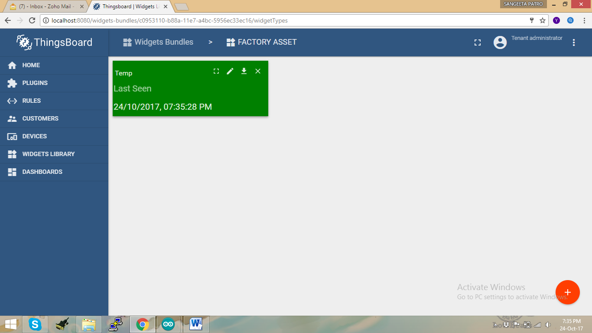
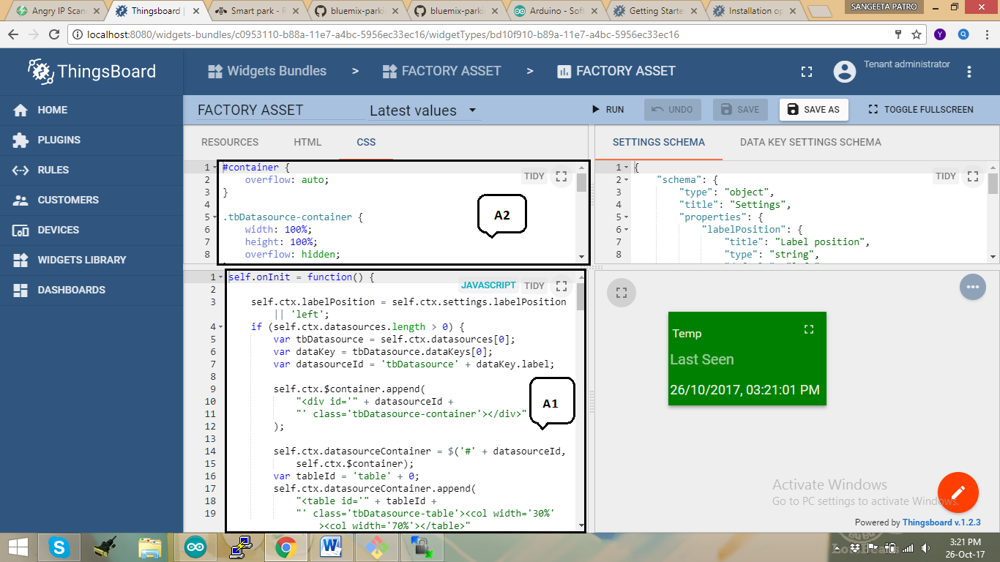
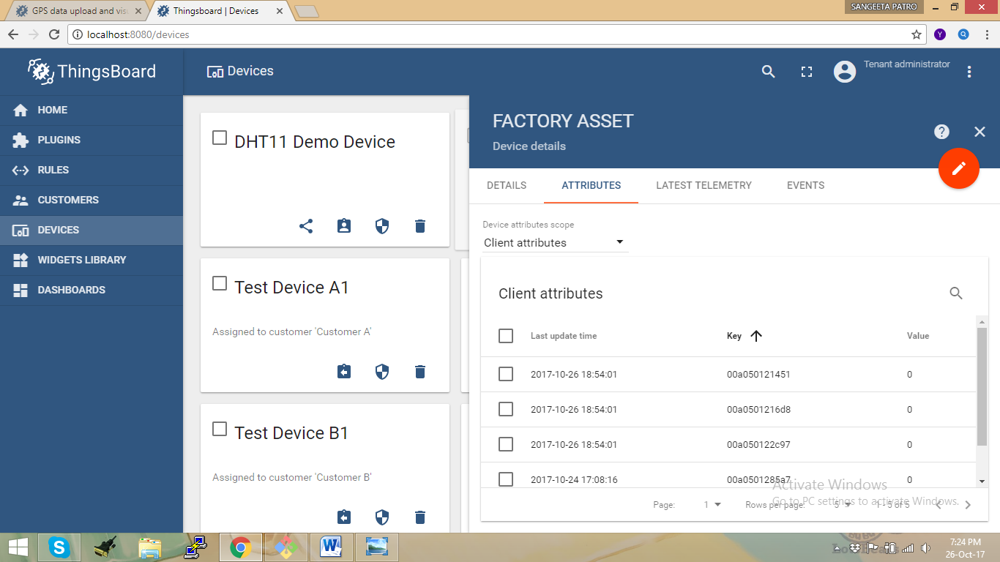
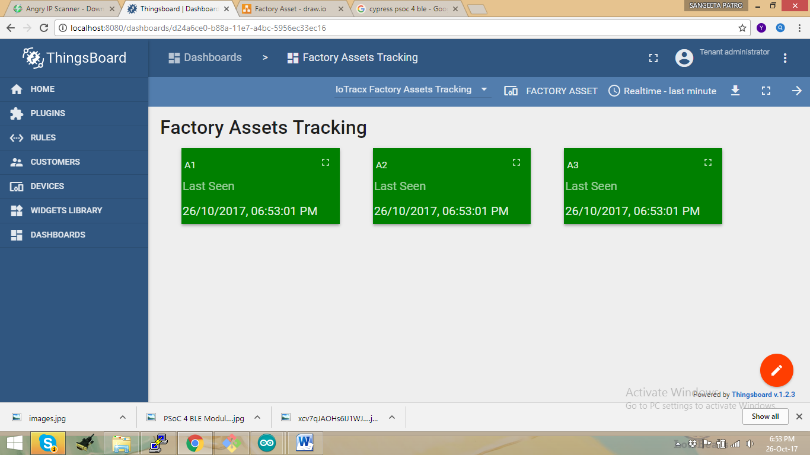

# Automated Physical Asset Verification using BLE

This repository contains the hardware setup details and source code for an automated asset verification system based on the BLE (Bluetooth Low Energy)

## OVERVIEW

This project uses Mediatek Linkit ONE board as a BLE gateway and Cypress 4.1 BLE / Beacon device as the BLE node. The application server is hosted on Thingsboard and enables users to track their physical assets attached with the BLE node. The LinkIt-One board acts as the BLE gateway that aggregates all beacon signals from the BLE nodes. It detects the presence or absense of assets in a specified area and updates this information on a dashboard hosted by the Thingsboard server.

## INTRODUCTION

This system is assumed to be installed in a Factory space or any close office space where there are movable or portable assets which need to be monitored. The system has two parts

1. Asset Management Server - The application server that runs on Thingsboard and also hosts the dashboard for real-time presence monitoring of assets. This is written in JavaScript.

2. Hardware - BLE Gateway along with the BLE end nodes that are configured as a beacon. Mediatek LinkitONE is the gateway and Cypress 4.1 BLE is the end node. There are three end nodes configured in this applicaiton which means that we can track three assets at a time. The code for hardware is written in C.

## BUILD & INSTALL STEPS

### Build Setup For hardware

The following hardware components are used for this project:

  1.	LinkIt-One v1.0

  2.	Cypress4.1

  3.	BLE and Wifi antenna
  

#### Programming the Linkit ONE Device

If you are familiar with basics of LinkIt One programming using Arduino IDE, then you can skip the following step
and proceed directly to step 2.

#### STEP 1 : LinkIt ONE and Arduino IDE setup

In order to start programming LinkIt One device, you will need Arduino IDE installed and all related libraries. Please follow this
[guide](https://docs.labs.mediatek.com/resource/linkit-one/en/getting-started) in order to install the Arduino IDE and LinkIt One SDK.

The above "Getting Started" guide also contains instructions for updating the LinkitONE firmware and try out your first LinkIt One sample application. 

#### STEP 2 : PubSubClient Library Installation

Open Arduino IDE and go to Sketch -> Include Library -> Manage Libraries. Find PubSubClient by Nick O’Leary and install it.

#### STEP 3 : BLE Application Application Code Config

Clone this repository and open the [application code for BLE gateway](code/hardware/asset_tracking.ino)

You will have to edit the following Macros/variables in the source code as per your network configuration

  •	WIFI_AP (Line 15) - SSID Name of your WiFi Access Point
  
  •	WIFI_PASSWORD (Line 16) - WiFi Password of Access Point
  
  •	WIFI_AUTH (Line 17) - WiFi Auth (choose one between LWIFI_OPEN, LWIFI_WPA, or LWIFI_WEP)
  
  •	TOKEN (Line 18) - the $ACCESS_TOKEN from ThingsBoard configuration step (See Below).
  
  •	thingsboardServer (Line 25) - The IP Address fo the server hosting Thingsboard
  
  •	BEACON_MAC_ADDR_1 , BEACON_MAC_ADDR_2 , BEACON_MAC_ADDR_3 (Line 21,22,23) - Known mac-addresses of the ble end nodes.
    
    
#### STEP 4 : BLE Application Application Code Install

Connect your LinkItONE device via USB cable and select Serial Debug COM port in Arduino IDE. Compile and Upload your sketch to the device using “Upload” button. Once the application starts, it will try to connect to ThingsBoard server using MQTT. Refer to the steps below to deploy ThingsBoard server to receive the messages from the Linkit ONE.

#### Troubleshooting

When the application is running, you can connect your device to Serial Debug COM port in Arduino IDE and open “Serial Monitor” in order to view debug information produced by serial output.

### Build Setup For Application Server

[ThingsBoard](https://thingsboard.io/) is a open source IoT platform. For this project we have used a Ubuntu server installed with ThingsBoard for orchestrating the messages between the assets and the dashboard.

#### STEP 1 : Installing ThingsBoard

Install the Thingsboard service [as per your Operating System](https://thingsboard.io/docs/user-guide/install/installation-options/) 

#### STEP 2 : Getting Started

Follow this [guide](https://thingsboard.io/docs/getting-started-guides/helloworld/) to get started 

#### STEP 3 : Configuration for Asset Tracking

Open the widget of Factory Asset Dashboard and click on edit button on the card.

Open the [JavaScript code](code/thingsboard/asset_tracking.js). Paste the JavaScript code in the JavaScript window , indicated with "A1" below. Similarly, open the [CSS stylesheet](code/thingsboard/asset_tracking.css) and paste it in the CSS window as shown with label "A2" below.

#### STEP 4 : Setup Dashboard

Go to “Devices” section and locate “FACTORY ASSET”, open device details and switch to “Attributes” tab. If all is configured correctly you should be able to see status of assets in attributes and their latest values in the table as shown in the picture.

And then you can visualize with a proper UI in Dashboard window as shown in the picture.

